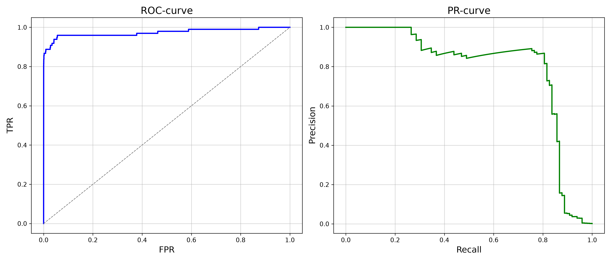

# Лабораторна робота №2. Поріг рішення під асиметричну ціну помилок

## Посилання на набір даних та команди відтворення

* **Набір даних:** [Credit Card Fraud Detection на Kaggle](https://www.kaggle.com/datasets/mlg-ulb/creditcardfraud)
* **Робоча директорія:** перед виконанням команд перейдіть у каталог роботи `lab2`:
  ```bash
  cd lab2
  ```
* **Аналіз зі збережених прогнозів без навчання:**
  ```bash
  uv run python lab2_starter.py --saved results
  ```
* **Навчання моделі з локального CSV:**
  Для тренування передайте шлях до локального файлу `creditcard.csv`, а також нову або порожню папку для збереження результатів:
  ```bash
  uv run python lab2_starter.py --data data/creditcard.csv --out new_results
  ```
  *Примітка: команди також можна запускати з кореня репозиторію, наприклад: `uv run python lab2/lab2_starter.py --saved lab2/results`*

---

## 1. Поділ вибірки та попередня обробка

Дані поділено у співвідношенні 60/20/20 за допомогою стратифікованого розбиття:

| Підвибірка | Кількість об'єктів | Кількість шахрайств | Частка шахрайських транзакцій |
| :--- | :---: | :---: | :---: |
| Train | 170 884 | 295 | 0.001726 |
| Validation | 56 961 | 98 | 0.001720 |
| Test | 56 962 | 99 | 0.001738 |

### Запобігання витоку даних на етапі стандартизації
Обчислення середнього та дисперсії на всьому наборі даних до розбиття призводить до витоку даних. У такому разі інформація про розподіл тестових та валідаційних прикладів неявно потрапляє в навчальну вибірку. Модель отримує оптимістичне зміщення, а оцінка її узагальнюючої здатності стає невалідною. Масштабування нових спостережень повинно спиратися виключно на статистики $\mu$ та $\sigma$, зафіксовані на навчальній вибірці.

---

## 2. Вибір порога на валідаційній вибірці

### Формула вартості помилок
$$C(t) = 10 \cdot FN(t) + FP(t)$$

### Оцінка кривих на Validation
* **ROC-AUC:** 0.9733
* **PR-AUC:** 0.7840

Криві збережено у файлі `results/validation_curves.png`:
<p align="center">
  
</p>

### Правильна інтерпретація ROC-AUC
Метрика ROC-AUC пов'язана з $FPR = \frac{FP}{FP + TN}$. За умови сильного дисбалансу класів кількість легітимних транзакцій є набагато більшою за можливі хибні спрацьовування моделі. Навіть сотні хибних тривог дають малі значення $FPR$, через що ROC-крива виглядає практично ідеальною, а площа під нею сягає 0.97+. Проте $Precision$ не враховує $TN$, тому за великої кількості $FP$ точність системи може бути низькою. ROC-AUC відображає лише загальну якість ранжування оцінок, але маскує збитки від хибних спрацьовувань.

### Алгоритм пошуку порога за $O(n \log n)$
1. **Кандидати:** усі унікальні оцінки валідаційної вибірки та граничний поріг $+\infty$.
2. **Сортування та кумулятивні суми:** оцінки та мітки сортуються за спаданням один раз за $O(n \log n)$. За допомогою одного проходу кумулятивних сум векторизовано накопичуються значення $TP$ і $FP$ для всіх кандидатів одночасно. Лічильники $FN = P - TP$ та $TN = N - FP$ обчислюються без повторних проходів по вибірці.
3. **Обробка рівних оцінок:** об'єкти з однаковим скором отримують однаковий прогноз - накопичення лічильників фіксується лише на останньому елементі групи однакових оцінок.
4. **Граничні випадки:** поріг $+\infty$ відповідає правилу, коли усі приклади негативні. Найменша оцінка відповідає стану, коли усі приклади позитивні.
5. **Розв'язання нічиєї:** якщо кілька різних порогів забезпечують однаковий мінімум функції вартості $C$, обирається найбільший із них. Вищий поріг гарантує меншу або рівну кількість хибних тривог за однакової фінальної вартості.

Повну таблицю кандидатів збережено у файлі `results/candidates.csv`.

### Підсумкова таблиця правил на валідаційній вибірці

| Правило на validation | Поріг | TP | FP | FN | TN | C |
| :--- | :---: | :---: | :---: | :---: | :---: | :---: |
| Стандартний поріг | 0.5 | 71 | 9 | 27 | 56 854 | 279 |
| Оптимум $t^*$ | 0.031194 | 82 | 34 | 16 | 56 829 | 194 |
| Усі негативні | $+\infty$ | 0 | 0 | 98 | 56 863 | 980 |

---

## 3. Перевірка реалізації пошуку порога на малих наборах

Швидкий алгоритм верифіковано прямим повільним перебором правила $s_i \ge t$. Результати перевірок збіглися повністю.

### Набір A: $s = [0.9, 0.7, 0.7, 0.4, 0.2, 0.1]$, $y = [0, 1, 0, 1, 0, 0]$

Перевіряє коректність обробки ситуацій, коли декілька об'єктів мають однакові оцінки, але належать до різних класів. Об'єкти з однаковим скором зобов'язані отримувати однаковий прогноз. Алгоритм не повинен розривати цю групу: оновлення кумулятивних сум фіксується лише на останньому елементі групи зв'язаних оцінок, що унеможливлює появу нефізичних проміжних станів між рівними скорами.

| Кандидат $t$ | TP | FP | FN | TN | C |
| :---: | :---: | :---: | :---: | :---: | :---: |
| $+\infty$ | 0 | 0 | 2 | 4 | 20 |
| 0.9 | 0 | 1 | 2 | 3 | 21 |
| 0.7 | 1 | 2 | 1 | 2 | 12 |
| **0.4** | **2** | **2** | **0** | **2** | **2** |
| 0.2 | 2 | 3 | 0 | 1 | 3 |
| 0.1 | 2 | 4 | 0 | 0 | 4 |

*Обраний поріг:* $t^* = 0.4$, мінімальна вартість $C = 2$.

### Набір B: $s = [0.9, 0.6, 0.3]$, $y = [0, 0, 0]$

Перевіряє поведінку алгоритму на граничному випадку вибірки без жодного позитивного прикладу. За будь-якого скінченного порога $t \le 0.9$ модель класифікує частину об'єктів як позитивні, що створює хибні спрацьовування і призводить до $C > 0$. Тест демонструє необхідність включення граничного порога $+\infty$, за якого $FP = 0$ і досягається єдиний глобальний мінімум вартості $C = 0$.

| Кандидат $t$ | TP | FP | FN | TN | C |
| :---: | :---: | :---: | :---: | :---: | :---: |
| **$+\infty$** | **0** | **0** | **0** | **3** | **0** |
| 0.9 | 0 | 1 | 0 | 2 | 1 |
| 0.6 | 0 | 2 | 0 | 1 | 2 |
| 0.3 | 0 | 3 | 0 | 0 | 3 |

*Обраний поріг:* $t^* = +\infty$, мінімальна вартість $C = 0$.

### Набір C: $s = [0.8, \underbrace{0.5, \dots, 0.5}_{11}, 0.2]$, $y = [1, 1, \underbrace{0, \dots, 0}_{10}, 0]$

Перевіряє коректність детермінованого розв'язання нічиєї. За рівної вартості алгоритм обирає найбільший із таких порогів. Це рішення є оптимальним з практичної точки зору, оскільки за однакової сумарної вартості надає перевагу суворішому правилу з мінімізацією кількості хибних блокувань.

| Кандидат $t$ | TP | FP | FN | TN | C |
| :---: | :---: | :---: | :---: | :---: | :---: |
| $+\infty$ | 0 | 0 | 2 | 11 | 20 |
| **0.8** | **1** | **0** | **1** | **11** | **10** |
| 0.5 | 2 | 10 | 0 | 1 | 10 |
| 0.2 | 2 | 11 | 0 | 0 | 11 |

*Обраний поріг:* $t^* = 0.8$, мінімальна вартість $C = 10$.

---

## 4. Тестова оцінка та аналіз помилок

### Формули метрик та обробка нульових знаменників
$$\text{Precision} = \frac{TP}{TP + FP}, \quad \text{Recall} = \frac{TP}{TP + FN}$$

* Якщо $TP + FP = 0$, що означає відсутність позитивних передбачень, знаменник для $Precision$ перетворюється на 0. Метрика є невизначеною, оскільки неможливо розрахувати частку істинних спрацьовувань серед множини, яка не містить позитивних прогнозів. У коді для такої ситуації за замовчанням значення метрики прирівнюється до 0.
* Якщо $TP + FN = 0$, що означає відсутність у вибірці позитивних прикладів, знаменник для $Recall$ перетворюється на 0. Метрика є невизначеною, оскільки частка знайдених шахрайств втрачає математичний зміст за відсутності самого факту шахрайств. У коді для такої ситуації за замовчанням значення метрики прирівнюється до 0.

### Результати застосування зафіксованого $t^*$ на Test

| Правило на test | Поріг | TP | FP | FN | TN | C | Precision | Recall |
| :--- | :---: | :---: | :---: | :---: | :---: | :---: | :---: | :---: |
| Поріг 0.5 | 0.5 | 71 | 8 | 28 | 56 855 | 288 | 0.8987 | 0.7172 |
| Зафіксований $t^*$ | 0.031194 | 80 | 43 | 19 | 56 820 | 233 | 0.6504 | 0.8081 |

### Таблиця перших 5 FP та 5 FN помилок на Test

| Рядок CSV | Тип помилки | Мітка | Оцінка $s$ | Відстань до порога | Amount |
| :---: | :---: | :---: | :---: | :---: | :---: |
| 460 | FP | 0 | 0.196159 | 0.164965 | 2.00 |
| 2961 | FP | 0 | 0.080961 | 0.049767 | 2.49 |
| 10783 | FP | 0 | 0.966327 | 0.935133 | 89.99 |
| 13405 | FP | 0 | 0.932032 | 0.900838 | 89.99 |
| 13617 | FP | 0 | 0.922762 | 0.891568 | 89.99 |
| 10497 | FN | 1 | 0.011464 | 0.019730 | 3.79 |
| 52521 | FN | 1 | 0.006373 | 0.024821 | 105.99 |
| 55401 | FN | 1 | 0.005642 | 0.025552 | 1.00 |
| 91671 | FN | 1 | 0.000500 | 0.030693 | 290.18 |
| 93486 | FN | 1 | 0.018352 | 0.012842 | 0.00 |

### Порівняння Amount та відстаней від порога
* **Помилки FP:** можна побачити певний поділ. Частина прикладів мають відносно невеликі оцінки в районі $0.08$–$0.19$ і розташовані близько до обраного порога. Інша частина рядків отримали високі скори, а саме більше за $0.92$, з великою відстанню від порога за однакової суми 89.99. Це може вказувати на те, що за ознаками $V_1$–$V_{28}$ вони сильно схожі на типові шаблони шахрайств.
* **Помилки FN:** усі 5 прикладів отримали скори нижче за $0.019$, перебуваючи на невеликій відстані від порога. Значення $Amount$ варіюються від 0.00 до 290.18, що показує відсутність прямої монотонної залежності між $Amount$ та оцінкою моделі.

### Правильна інтерпретація порівнянь на 10 прикладах
Вибірка з 10 рядків відображає лише перші за порядком появи приклади в CSV-файлі. Тому однозначних та обгрунтованих висновків по ним робити не можна. Крім того, на результат, очевидно, впливає не тільки змінна $Amount$, а й інші 28 ознак. Тому встановити точні змістовні причини помилок без аналізу всіх ознак для більшої кількості даних неможливо.

---

## Підсумкові висновки

1. **Що змінив вибір порога в роботі незмінної моделі:** 
   Без зміни ваг чи архітектури нейромережі зміна порога з 0.5 на $t^* = 0.031194$ змінила інтерпретацію оцінок класифікатора. Здійснився перехід з режиму симетричної мінімізації загальної кількості помилок у режим, адаптований під асиметричну вартість, що зменшило вартість з $279$ до $194$ на валідаційній вибірці, та з $288$ до $233$ на тестовій вибірці, порівняно із класичним порогом у $0.5$.
2. **Ціна рішення в термінах FP і FN:**
   На тестовій вибірці запобігання 9 додатковим випадкам пропущеного шахрайства, тобто зменшення $FN$ з 28 до 19, коштувало 35 додаткових хибних спрацьовувань, тобто збільшення $FP$ з 8 до 43. Оскільки штраф за кожне пропущене шахрайство дорівнює 10, чистий виграш склав:
   $$\Delta C = 10 \cdot (-9) + 35 = -55$$
3. **Чому результат на валідаційній вибірці не гарантує такого самого виграшу на тестовій:**
   Через сильний дисбаланс класів позитивна вибірка містить 98 прикладів на валідаційну та 99 на тестову вибірки. На такій малій кількості об'єктів вибіркова дисперсія є суттєвою. Поріг $t^*$ мінімізує емпіричну східчасту функцію вартості саме під конкретний розподіл скорів валідаційного набору. На тестових даних локальна щільність оцінок навколо межі дещо відрізняється, тому кількісний виграш варіюється.

---

## Використання генеративного штучного інтелекту

Gemini Flash 3.8 використовувався для створення каркасу звіту, після чого він уточнювався та деталізовувався вручну.